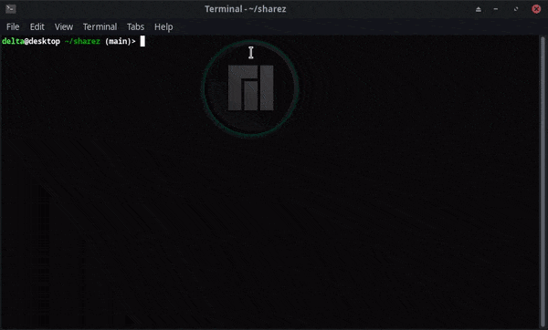
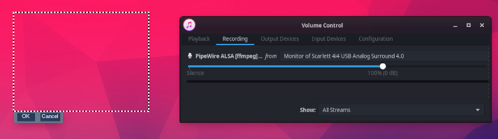

# sharez
Small Python script utilizing slop, ffmpeg, and transfer.sh to replicate "ShareX-esque" video recording functionality on Linux

### Dependencies:
`slop`, `ffmpeg`, `curl`, `xclip`, `tk`

`pip install pysimplegui playsound`

### Usage:
Either manually trigger the script with `python capture.py`, or create a keyboard shortcut that runs that command. 

Click and drag to select the region to record, and the recording will immediately begin.

There will be an OK button below or above the recording region, when pressed it will immediately stop recording and upload the video to transfer.sh, and then copy a shareable URL to the clipboard.

By default, the recording will be saved in the same directory as `capture.py`.

### Commandline Flags:

* `--rm` - remove the video file after script runs
* `--no-copy` - do not copy link to clipboard
* `--no-upload` - do not upload to transfer.sh
* `--no-soundfx` - do not play sound effects
* `--no-audio` - do not record audio
* `--path=/home/example` - path to save video
* `--filename=example.webm` - filename (extension can be either `.webm` or `.mp4`)
* `--vlc` - before uploading, open the video in VLC to preview (requires VLC to be installed)

### Audio Capture:

It will use the default ALSA audio device for capture. If you have `pavucontrol`, you can change this under the Recording tab **while sharez is actively recording something**, and it will remember what you have selected in future recordings.

Use the "Monitor of [device]" options to capture your desktop audio output. If these don't show up, you might need to install `PipeWire`.

