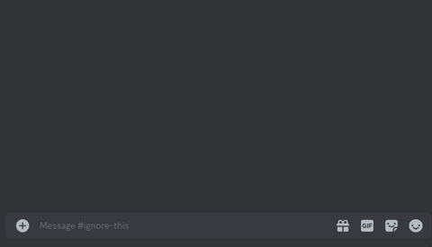
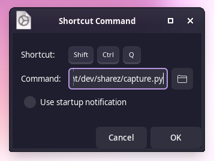
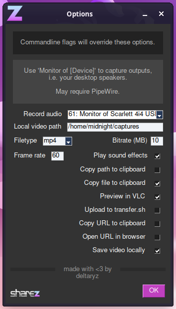
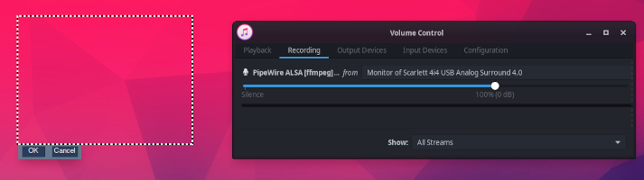

Finally. Your desktop recording prayers have been answered.

This is a [ShareX](https://getsharex.com/)-inspired video recording utility for Linux/X11, engineered to minimize required clicks/keypresses and be friendly to scripting and automation.



## Install Instructions:

Only Xorg environments are supported. Wayland is not currently implemented, but it is planned.

- Obtain the repository with `git clone https://github.com/deltaryz/sharez` or downloading and extracting the ZIP from this page
- If you use `git` to acquire sharez, you can quickly update it with `git pull` inside the `sharez` folder

### Arch / Manjaro
- `sudo pacman -S python3 slop ffmpeg curl xclip tk python-pip`
- `pip install pysimplegui playsound`
  - (you may need either venv or `--break-system-packages`)
- (Optional) It is strongly recommended to use PipeWire with WirePlumber and PulseAudio support for maximum functionality:
  - `sudo pacman -S pipewire pipewire-audio pipewire-pulse`

### Ubuntu / Debian
- `sudo apt install python3 slop ffmpeg curl xclip tk python3-tk python3-pip`
- `pip install pysimplegui playsound`
  - (you may need either venv or `--break-system-packages`)
- (Optional) It is strongly recommended to use PipeWire with WirePlumber and PulseAudio support for maximum functionality:
  - [Debian instructions](https://wiki.debian.org/PipeWire#Installation)
  - [Ubuntu instructions](https://gist.github.com/the-spyke/2de98b22ff4f978ebf0650c90e82027e) - only required for 22.04 and earlier, >=22.10 have this by default

### Other

Install your distro's equivalents of the following packages:
- `python3`, `slop`, `ffmpeg`, `curl`, `xclip`, `tk`
- `pip install pysimplegui playsound`
- (Optional) `pipewire`, `pipewire-audio`, `pipewire-pulse`, `wireplumber`

## Usage:
Either manually trigger the script with `python3 capture.py`, or create a keyboard shortcut to run this.



- **GNOME**: Settings, Keyboard, View and Customize Shortcuts, Custom Shortcuts, Add Shortcut
- **XFCE**: Keyboard settings, Application Shortcuts tab

Click and drag to select the region to record, and the recording will immediately begin.

There will be OK/Cancel buttons near the recording region, when pressed it will immediately stop recording.

After the recording stops, if the user pressed OK it will automatically save, upload, or copy to clipboard - behavior is configurable with GUI settings and command flags.

By default, recordings will save to `~/Videos`.

## Configuration:

All of these parameters are configurable in the GUI settings menu, and saved in `~/.config/sharez/config.json`. Command flags take priority over saved settings.

Checkboxes/flags are listed in the order they are executed by the program.



### NOTE: While developing this, the public transfer.sh service appears to have gone offline. This default URL will not function.
#### Advanced users can [self-host transfer.sh](https://github.com/dutchcoders/transfer.sh), or achieve similar functionality with your save path exposed to a webserver (see example below).

* `--filename example.webm` - filename / format
  * Supported formats: `.webm`, `.mp4`
  * Default filename: `$(date '+%Y-%m-%d_%H.%M.%S').mp4`
  * Extension is optional, if omitted will use saved setting
* `--audio default` - record audio
  * Supports pulseaudio device IDs obtained with `pactl list short sources`
  * `default` uses ALSA default, can be configured with `pavucontrol`
  * Can be `disabled`
* `--path /home/example/Videos` - path to save video
* `--framerate 60` - recording framerate (lower this if your PC can't keep up)
* `--soundfx true` - play sound effects
* `--copy-path false` - copy file path to clipboard
* `--copy-file true` - copy file to clipboard
* `--preview false` - open the video in VLC to preview (requires VLC to be installed)
* `--tsh-url https://transfer.sh` - URL of [transfer.sh service](https://github.com/dutchcoders/transfer.sh)
* `--upload false` - upload to transfer.sh
* `--copy-url true` - copy URL to clipboard
* `--browser false` - open URL in browser
* `--save true` - keep local recording after script finishes

Example command to upload to transfer.sh and remove local file after finishing: 
```sh
python3 capture.py --upload true --tsh-url https://example.website --copy-url true --save false
```

Example script to use in conjunction with personal webserver:
```bash
#!/bin/bash

filename=$(date '+%Y-%m-%d_%H.%M.%S').mp4
filepath=/example/www/s/
share_url=https://example.website/s/

python3 capture.py --filename=$filename --path=$filepath

echo $share_url$filename | xclip -i -selection clipboard
```

## Audio Capture:

Use the "Monitor of [device]" options to capture your desktop audio output. If these don't show up, you might need to install `PipeWire` and its pulseaudio compatibility extensions.

There is now a built-in dropdown to select your audio device, but if sharez cannot detect your device this way, you can still attempt other methods.

Using the ALSA Default output, open `pavucontrol` and look at the Recording tab **while sharez is actively recording something**. The dropdown in here will change the device sharez records, and it will remember what you have selected in future recordings.

Another way to view potential recording devices is with `pactl list short sources`, you can use these IDs with the `--audio=69` command flag.

