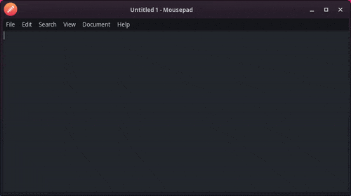

Finally. Your desktop recording prayers have been answered.

This is a [ShareX](https://getsharex.com/)-inspired video recording utility for Linux/X11, engineered for ease-of-use and convenience. 

## Install Instructions:

Only Xorg environments are supported. Wayland is not currently implemented, but it is planned.

- Obtain the repository with `git clone https://github.com/deltaryz/sharez` or downloading and extracting the ZIP from this page
- If you use `git` to acquire sharez, you can quickly update it with `git pull` inside the `sharez` folder

### Arch / Manjaro
- `sudo pacman -S python3 slop ffmpeg curl xclip tk python-pip`
- `pip install pysimplegui playsound`
  - (you may need either venv or `--break-system-packages`)

### Ubuntu / Debian
- `sudo apt install python3 slop ffmpeg curl xclip tk python3-tk python3-pip`
- `pip install pysimplegui playsound`
  - (you may need either venv or `--break-system-packages`)

### Other

Install your distro's equivalents of the following packages:
- `python3`, `slop`, `ffmpeg`, `curl`, `xclip`, `tk`
- `pip install pysimplegui playsound`

## Usage:
Either manually trigger the script with `python3 capture.py`, or create a keyboard shortcut to run this.

- **XFCE**: Keyboard settings, Application Shortcuts tab

Click and drag to select the region to record, and the recording will immediately begin.

There will be OK/Cancel buttons near the recording region, when pressed it will immediately stop recording.

After the recording stops, if the user pressed OK it will automatically upload the video to transfer.sh, and then copy a shareable URL to the clipboard.

The recording will also be saved locally in the same directory as `capture.py`.

## Commandline Flags:

* `--rm` - remove the video file after script runs
* `--no-copy` - do not copy link to clipboard
* `--no-upload` - do not upload to transfer.sh
* `--no-soundfx` - do not play sound effects
* `--no-audio` - do not record audio
* `--path=/home/example` - path to save video
* `--filename=example.webm` - filename (extension can be either `.webm` or `.mp4`)
* `--framerate=60` - recording framerate (lower this if your PC can't keep up)
* `--vlc` - before uploading, open the video in VLC to preview (requires VLC to be installed)

Example command: `python3 capture.py --filename=$(date '+%Y-%m-%d_%H.%M.%S').webm --no-upload --path=/home/somebody/captures`

## Audio Capture:

It will use the default ALSA audio device for capture. If you have `pavucontrol`, you can change this under the Recording tab **while sharez is actively recording something**, and it will remember what you have selected in future recordings.

Use the "Monitor of [device]" options to capture your desktop audio output. If these don't show up, you might need to install `PipeWire`.

